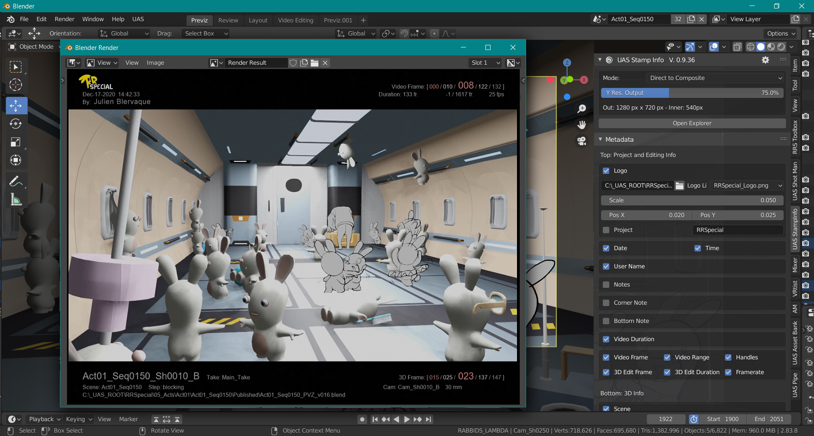

# Ubisoft Stamp Info - Blender Add-on

 

**Stamp Info creates a frame around the rendered images and writes scene information on it.
It is a flexible alternative to the Metadata post processing integrated system of Blender.**

  
  &nbsp;&nbsp;&nbsp;
  
  &nbsp;&nbsp;&nbsp;
  

## Disclaimer

>**This tool is NOT SUPPORTED ANYMORE. It has been integrated inside Ubisoft Shot Manager V2.0+**
>
>**It was supporting LTS version of Blender 2.93 and up to Blender 3.0**
>
>It was initially developed for an animated TV series production in 2020 on Blender 2.83. It has the features that were needed at the time but it
may not be considered as feature complete for a more generic purpose. In spite of all our efforts to make it reliable some troubles may occur in use cases we have not faced.
>

 

 

## Installation:
Stamp Info can be installed as any standard Blender add-on. Nevertheless:

>The addon must be installed in Administrator mode so that the Pillow Python library can
>be downloaded and deployed correctly. Also be sure that your firewall doesn't block the download (or use OpenVPN or equivalent).

Refer to the documentation for the detailed installation steps: [https://ubisoft-stampinfo.readthedocs.io/en/latest/getting-started/install.html](https://ubisoft-stampinfo.readthedocs.io/en/latest/getting-started/install.html)

## Principle

   - When pressing one of the 2 render buttons of the Stamp Info panel 2 temporary sets of images are generated:
       - The rendered images, as for a classical rendering. They are put in a temporary folder though,
         at the root of the rendering path;
       - The "stamped info" images are generated with PIL, the Python Image Library. They received a frame
         and the text for all the specified metadata to display;
 

   - Then the 2 sets of images are composited into the VSE thanks to a routine. This produces the final rendering sequence
     and it is stored in the rendering path specified in the scene.

   - Unless changed in the Preferences both temporary folders are then deleted.

   Note: In order to mimic as much as possible the actual way of working of Blender and so as to avoid frames in a rendered sequences to be
   overwritten by mistake the still images are saved on disk with a file name starting with the prefix "_Still".

## Features

- [Features and limitations](https://ubisoft-stampinfo.readthedocs.io/en/latest/features/features.html)
- [History](./CHANGELOG.md)

# FAQ and Troubleshooting

   - [FAQ and Troubleshooting](./doc/faq)

## Dev notes

This add-on requires the Python library [Pillow](https://pypi.org/project/Pillow/). This library is automatically downloaded and deployed on the
Blender instance when Stamp Info is installed.

# Reusable code
Files located in the utils\ directory are independent modules that can be re-used in other Blender add-ons.

The following ones are particularly interesting:

   - [Sequence Path class](./doc/utils_filenames.md)

# Support

The active support repository is on the [StampInfo GitHub repository](https://github.com/ubisoft/stampinfo) which is part of the [Ubisoft open source](https://github.com/ubisoft) projects group.

# License and copyright

The original code is Copyright (C) 2021 Ubisoft.

All code of the `stampinfo` package is under the GPLv3 license.
